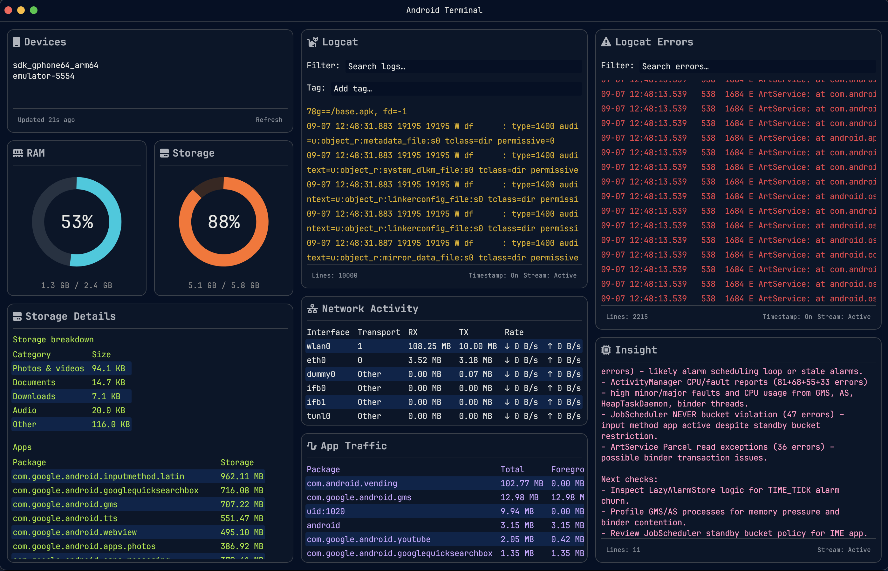

# Android Dashboard

[](LICENSE)


[](https://github.com/GunnarKarlsson/android-tui/actions/workflows/ci.yml)
[](https://github.com/GunnarKarlsson/android-tui/stargazers)

A dashboard written in Rust for debugging Android devices and emulators on macOS. 
Shows essential Android debug data in a single window.



## Prerequisites

- **Rust** 1.88+ (see `rust-toolchain.toml`)
- **Android SDK platform-tools** with `adb` on your `PATH`

Install platform-tools via [Android Studio](https://developer.android.com/studio) and verify adb is available:

```bash
adb version
```
You'll need an Android device connected, via USB or via emulator.

## Build

```bash
cargo build
```

## Run the Dashboard

```bash
cargo run -p android-terminal
```

## Project layout

```
crates/
  adb-client/       # adb command wrappers and parsing
  ai-insight/       # error clustering and Chat Completions client
  android-terminal/ # GUI application
```

## How to Use the Dashboard

In the dashboard's upper left devices widget, select the device you want to inspect. This will populate the dashboard with the device's data. The first device in the device list is automatically selected on start. The device list is ordered as per `adb devices -l`.

## Widgets

The dashboard shows the following data in widgets:

| Widget | Description |
| --- | --- |
| Devices | Connected emulators and USB devices. |
| RAM | Live memory usage. |
| Storage | Live internal storage. |
| Logcat | Streaming logcat for the selected device. Allows filtering by text and tag. |
| Logcat Errors | Logcat but only errors and fatals. |
| Insight | An LLM's opinion on the error logs. See [AI insights](#ai-insights) for details. |
| Storage Details | Directory totals and per-app storage. |
| Network Activity | Per-interface RX/TX totals and current down/up rates. |
| App Traffic | Network usage by app/package. |

## AI insights

The dashboard app submits a normalized logcat error log to a Chat Completions API of your choice, and displays the response.
Before dispatch to the API, error and fatal logcat lines are summarized, noise-stripped and filtered to remove secret data. 

When the mix of errors changes, the app posts again, with a cooldown.

The model replies with a one-line verdict (`HEALTHY` / `DEGRADING` / `FAILING`), top issues, and a recommendation for what to do next. That text shows in the **Insight** panel.

No request is sent until `AI_PROVIDER_API_KEY` is set.

## Configuration

The app requires configuration only in the case you want to see AI insights.

### Configure AI provider - Details

Settings are read from the process environment. 
On startup the app also loads `crates/android-terminal/.env` if that file exists.

| Variable | Required | Default |
| --- | --- | --- |
| `AI_PROVIDER_API_KEY` | yes | (empty — Insight is skipped) |
| `AI_PROVIDER_BASE_URL` | no | `https://api.deepseek.com` |
| `AI_PROVIDER_MODEL` | no | `deepseek-v4-pro` |

Example `.env`:

```
AI_PROVIDER_API_KEY=sk-...
AI_PROVIDER_BASE_URL=https://api.deepseek.com
AI_PROVIDER_MODEL=deepseek-v4-pro
```

The provider should accept [OpenAI Chat Completions](https://platform.openai.com/docs/api-reference/chat/create): `POST {AI_PROVIDER_BASE_URL}/chat/completions` (include `/v1` in the base URL if that is part of the path):

```http
POST /chat/completions
Authorization: Bearer ${AI_PROVIDER_API_KEY}
Content-Type: application/json

{
  "model": "${AI_PROVIDER_MODEL}",
  "temperature": 0.2,
  "max_tokens": 350,
  "stream": false,
  "thinking": { "type": "disabled" },
  "messages": [
    { "role": "system", "content": "..." },
    { "role": "user", "content": "<error snapshot JSON>" }
  ]
}
```

The `"thinking"` field is sent for DeepSeek. Other hosts typically ignore unknown fields.

Expected response format from API:

```json
{
  "choices": [
    {
      "message": {
        "role": "assistant",
        "content": "FAILING\nTop issues: ...\nNext checks: ..."
      }
    }
  ]
}
```